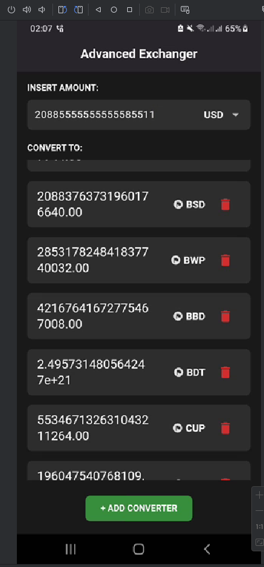

# Advanced Exchanger



## Description

This is a simple currency exchanger that uses the [ExchangeRate-API](https://www.exchangerate-api.com/) to get the latest exchange rates. It is built using the Flutter framework and the Bloc state management pattern.

## Features

 - Dynamic Currency Conversion: Convert an input amount to multiple preferred currencies.
 - Add Preferred Currencies: Users can dynamically add/remove currencies for conversion.
 - State Management: Managed efficiently using the Bloc pattern.
 - Clean Architecture: Separation of concerns for easy maintainability.

## Project Architecture

This project uses feature-based clean architecture for the following reasons:

1. Separation of Concerns:
   - UI (Presentation), State Management (Bloc), and Data are isolated, ensuring clean and maintainable code.
   
2. Modularity:
   - Each feature (features.convertor) has its own widgets, bloc, data, and presentation folders, making it easier to scale and add new features.
   
3. Reusability:
   - Shared constants, utilities, and widgets reside in the core folder, reducing duplication and promoting reusability.
   
4. State Management:
   - The Bloc pattern separates the business logic from the UI, providing predictable state transitions.
   
5. Testability:
   - The architecture is designed to be test-friendly as each layer (data, bloc, UI) is independent.
   

## Installation

1. Clone the repository:
    ```git clone https://github.com/Sandun-Induranga/currency-converter-app.git```

2. Go to the project directory:
    ```cd currency-converter-app```

3. Install the dependencies:
    ```flutter pub get```

4. Run the app:
    ```flutter run```

## How the App Works

1. Currency Fetching:
    - Exchange rates are fetched using the repository in the convertor_repository.dart file.
   
2. State Management:
    - Events are dispatched to the ConvertorBloc to fetch and update currencies.
    - UI listens to Bloc states for updates.
   
3. Dynamic UI:
    - Users can:
        - Input an amount.
        - Select a base currency.
        - Add/remove preferred currencies dynamically.

## Key Files and Folders

1. convertor_bloc.dart: Manages the state of the Convertor feature.
2. convertor_repository.dart: Fetches exchange rates from the API and manage preferred currencies.
3. api_constants.dart: Contains the Base URL and key.
4. convertor_view.dart: UI for the Convertor feature.
5. core: Contains shared constants, utilities, and widgets.
6. main.dart: Entry point of the app.
7. main_app.dart: Contains the MaterialApp widget.
8. theme.dart: Contains the app theme.

## Dependencies

- flutter_bloc: State management using the Bloc pattern.
- http: HTTP client for making API requests.
- shared_preferences: For storing user preferences.
- flutter_screenutil: For responsive UI design.

